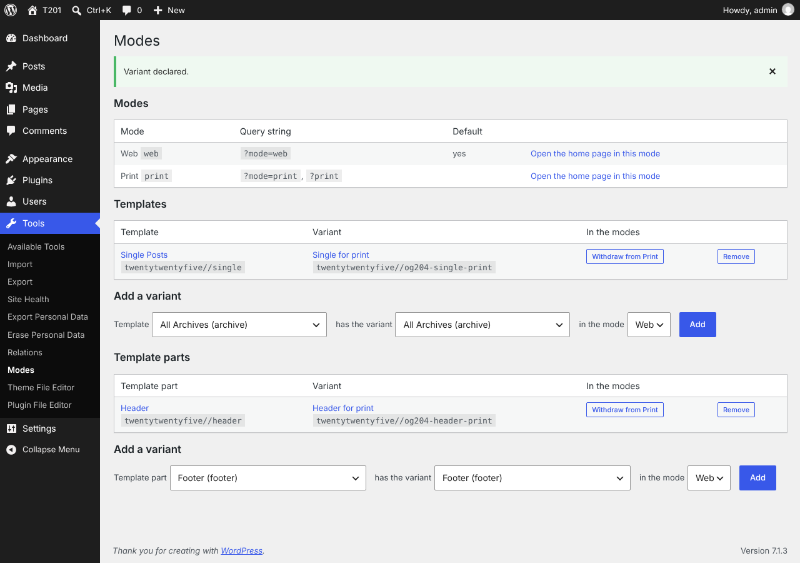

<!-- SPDX-FileCopyrightText: 2026 Eric van der Vlist <vdv@dyomedea.com> -->
<!-- SPDX-License-Identifier: GPL-3.0-or-later -->

# Slice 204 — Modes: the screen of the variants

Status: **done**, planned and coded in one go at Eric's request; the choices below are **to confirm**. Dependencies: slices 105 (the model of the administration screen), 200 to 203. Module: `Modes`.

## Goal

Declare, see and withdraw the variants of templates and template parts without writing code: **Tools → Modes**. After this slice `?print` can be set up entirely from the administration.

## The screen

One page, no JavaScript:

- **Modes**: each mode, how a request asks for it (`?mode=print`, `?print`), which one is the default, and a link that opens the home page in that mode.
- **Templates** and **Template parts**: one table each. A row is a relation (template, variant) with the modes it serves; each mode has a button **Withdraw from …** and the row has **Remove** (every mode). Labels link to the site editor; a template or variant that no longer exists is marked **(missing)** ([screenshot](../screenshots/204-missing-template.png)).
- **Add a variant** under each table: *template* has the variant *template* in the mode *mode* (lists of the templates of the active theme: block templates from the database and from files, and for a classic theme the PHP files at the root of the theme). The two lists are the same, since a variant is another template of the same theme.

## Enabling and disabling the modes

At the top of the screen, a checkbox **Enable the modes on this site** (saved through the Settings API, option `modes_settings`, key `enabled`; enabled by default; [screenshot](../screenshots/204-modes-disabled.png)). When it is off:

- the query string is not read: `?mode=` and aliases such as `?print` are ignored and every request is in the default mode (`modes_active_mode()` answers with it);
- no variant is applied to templates or template parts, and the body gets no `modes-mode-…` class;
- the screen, the variants and the registrations in Triples stay, with a warning at the top, so that the modes can be set up and enabled again;
- the setting is read at each request: enabling or disabling takes effect at once. Uninstalling the plugin removes the option.

The page is not shown to users without the capability, and the notices say the result (declared, withdrawn, removed) or why a request was refused (the rules of slice 202: a template cannot be its own variant, a second variant in the same mode, a template or mode that does not exist...).

## Handlers

Three `admin_post_` actions, `modes_declare`, `modes_withdraw` and `modes_remove`, each with its own nonce action. They check the capability, then the nonce, before reading anything; they read a kind (`template` or `template_part`), two template ids of the right shape and a registered mode; anything else is `invalid_request`. The work is `Variants::declare()`, `withdraw()` and `remove()`; the refusals of the variants and of Triples come back as notices with a code. Withdrawing and removing have **no confirmation page** (unlike the deletions of the Triples screen): they are reversible by adding the variant again, and each button belongs to one row.

## Capability and names

- Capability: **`edit_theme_options`**, the one of the site editor, since the screen is about templates; the filter **`modes_admin_capability`** changes it. The module has its own `Environment` (capability, nonces, input, links) and does not use the one of Triples (module rule 4).
- Text domain `modes`; the filter names, actions and the page slug (`tools.php?page=modes`) are the module's.
- The screen is hooked **in the administration only** (`Module::boot()` with an injected `is_admin`).

## Other changes

- `Variants::relations( $kind )` (every relation with its modes) and `Variants::describe()`; `TemplateLookup::templates( $type )` for the lists.
- `Module` takes an optional `$is_admin`; `Settings` (the option), `SettingsPanel` (the form, the registration with the Settings API, the capability of the option page through `option_page_capability_modes_settings_group`).
- `VariantApplier::block_data()` now tests the kind of request before it asks for the theme.

## Tests

- Integration (database), `ModesAdminDbTest` (10 tests): capability and nonce of each handler (including the nonce of another action), declare (idempotent), every refusal as a notice with its code and nothing stored, withdraw and remove, the page (modes, aliases, links, relations with their modes, buttons, forms, nonces, lists, escaping of a title that contains `<script>`), a missing template, the empty states, the page refused, the notices, the menu entry and the hooks, in the administration only.
- Unit and integration of `Variants::relations()`; `ModesSettingsTest` (7 tests: default, disabled and enabled again, sanitizing, the module in both states, read at each request, uninstall) and the form of the setting in `ModesAdminDbTest`.
- **On a real WordPress 7.1.3 in Chromium** ([`tests/real-wordpress/modes-screen/`](../../tests/real-wordpress/modes-screen/flow.js), 37 checks, no PHP error and no failed request): opening the page under Tools; declaring a variant with the form and seeing it on the front end in print mode and not otherwise; a second mode on the same relation and its withdrawal (a variant of the default mode applies to requests without a mode); the refusals as messages; a template part variant (on an archive, whose template has the header part); a template deleted behind the screen's back, shown as missing while the front end still answers 200; remove; a missing or false nonce refused (403); an editor and a subscriber (no `edit_theme_options`) refused, also with a valid nonce of another action; the setting: disabling it through `options.php` makes `?print` and `?mode=print` show the normal templates and parts with no mode class (while the variants stay listed and editable), enabling it brings everything back at once; the Triples screen still lists the new types and predicates.

## Not verified

Other browsers, narrow screens, keyboard use and contrast; multisite; child themes (the lists of templates come from `get_block_templates()`, whatever it returns for a child theme); a theme with hundreds of templates (the lists are not paged or searchable); translations.

## To confirm

0. The setting that enables the modes: on by default, one checkbox on the screen, the data kept while it is off.
1. The screen is **Tools → Modes**, one page with the modes, two tables and two forms, no JavaScript.
2. Capability `edit_theme_options` with the filter `modes_admin_capability`.
3. No confirmation page for withdrawing a mode or removing a relation.
4. The lists of templates offer every template of the active theme for both ends.
5. A relation to a missing template is shown and removable, not hidden.
